# Anik Sen — Portfolio CMS

> **A production-grade, glassmorphic single-page portfolio with a full PHP Content Management System.**

Built for **Anik Sen** (Graphic Designer & Video Editor), this project delivers a handcrafted, animated portfolio frontend backed by a self-hosted PHP 8 CMS, session-authenticated admin dashboard, CSRF protection, visitor analytics, and a zero-config SQLite database (with full MySQL support for production).

No Composer. No build step. No JavaScript framework. Just clean, object-oriented PHP 8 and vanilla HTML/CSS/JS — deployable to any commodity shared host.

> **Developer / Maintainer:** Aryaan Dhar Badhon

---

## Table of Contents

1. [Live Preview](#1-live-preview)
2. [Feature Highlights](#2-feature-highlights)
3. [Tech Stack](#3-tech-stack)
4. [Project Structure](#4-project-structure)
5. [Local Development](#5-local-development)
6. [Database Configuration](#6-database-configuration)
7. [Admin Panel — Complete Guide](#7-admin-panel--complete-guide)
8. [GitHub Actions Deployment](#8-github-actions-deployment)
9. [Shared Hosting Deployment](#9-shared-hosting-deployment)
10. [VPS / Cloud Deployment](#10-vps--cloud-deployment)
11. [SEO & Core Web Vitals](#11-seo--core-web-vitals)
12. [Security Checklist](#12-security-checklist)
13. [Troubleshooting](#13-troubleshooting)
14. [Credits](#14-credits)

---

## 1. Live Preview

### Portfolio Frontend — Hero Section

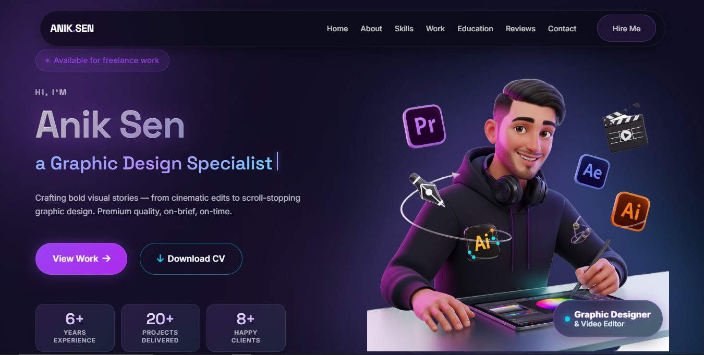

The hero section features a 3D animated avatar, typewriter role animation, floating stats bar, and dual CTA buttons (View Work / Download CV). The entire page is a single scroll experience with glassmorphic cards and smooth section reveal animations.

**Frontend Sections:**

| Section | Description |
|---|---|
| **Hero** | Name, animated role titles, intro text, stats (experience / projects / clients), CTA buttons |
| **About** | Biography, profile photo, core competencies list |
| **Skills** | Proficiency bars for design tools + software icon grid |
| **Work / Projects** | Filterable portfolio cards with cover image, category, description, links |
| **Gallery** | Categorised image lightbox |
| **Trusted Clients** | Client logos with optional website links |
| **Reviews** | Star-rated client testimonials |
| **Education** | Timeline of academic and professional qualifications |
| **Contact** | Contact form that stores messages in the admin inbox |

---

## 2. Feature Highlights

- **100% CMS-driven** — every visible string, image, project, skill, review and menu item is editable from `/admin/` without touching code.
- **Glassmorphic UI** — frosted glass cards, soft purple/blue radial gradients, `@keyframes` float animations, scroll-reveal effects, animated typewriter headline.
- **Section visibility toggles** — show or hide any section from the admin without editing files.
- **Dynamic header & footer menus** — CRUD-managed `menu_items` table; changes appear instantly.
- **Contact inbox** — paginated, searchable, read/unread state, hard-delete.
- **CV / Resume PDF upload** — strict `%PDF` magic-byte + `finfo` MIME validation; streamed securely via `cv.php`.
- **Unique-visitor analytics** — privacy-friendly salted SHA-256 IP hashing (no raw IPs stored), Chart.js dashboard with Weekly / Monthly / Yearly views.
- **CSRF protection** — every state-changing POST is covered by a per-session token.
- **Rate-limited login** — wrong-password attempts are tracked per session.
- **WAF-safe codebase** — all URL detection uses `preg_match` filename validation instead of string-literal `://` checks. External URLs in HTML output are encoded client-side via `base64` + `atob()` to avoid shared-hosting WAF blocks.
- **Zero-config** — SQLite by default; one environment variable switch activates MySQL.
- **Responsive** — 320 px mobile to 4K, `prefers-reduced-motion` honoured everywhere.
- **No build step, no Composer** — PSR-4-style autoloader is hand-rolled in `bootstrap.php`.

---

## 3. Tech Stack

| Layer | Technology |
|---|---|
| Language | PHP 8.1+ |
| Database | SQLite 3 (default) · MySQL 5.7+ / MariaDB 10+ |
| Frontend | HTML5, CSS3 (custom ~2,000 lines), Vanilla JS, Chart.js |
| Admin UI | Tailwind CSS (CDN, admin-only) |
| Server | Apache · Nginx + PHP-FPM · PHP built-in dev server |
| CI/CD | GitHub Actions + `SamKirkland/FTP-Deploy-Action` |
| Hosting tested | AwardSpace, InfinityFree, 000webhost, Replit, VPS |

---

## 4. Project Structure

> **Upload the entire project folder directly into your host's `public_html/` or `www/` directory.** `index.php` lives at the root — there is no nested `/public` sub-folder to configure.

```
project-root/                     ← upload everything here into public_html/
│
├── index.php                     ← front controller — all page routing
├── contact.php                   ← contact form POST handler
├── cv.php                        ← securely streams the active CV PDF
├── health.php                    ← {"status":"ok"} for uptime monitoring
├── router.php                    ← PHP built-in dev server only (not used in prod)
├── .htaccess                     ← Apache URL rewriting + security deny rules
├── bootstrap.php                 ← autoloader · config · DB · session · migrations
│
├── classes/                      ← OOP domain layer  (namespace App\)
│   ├── Database.php              ← PDO singleton  (SQLite + MySQL)
│   ├── Migrator.php              ← versioned, idempotent schema migrations
│   ├── Auth.php                  ← admin login · session · bcrypt hashing
│   ├── Csrf.php                  ← per-session CSRF tokens
│   ├── Upload.php                ← image + PDF uploads (MIME + magic-byte validation)
│   ├── Hero.php                  ← hero copy · avatar · CV PDF
│   ├── About.php
│   ├── Skill.php / Software.php
│   ├── Project.php / ProjectImage.php
│   ├── GalleryCategory.php / GalleryImage.php
│   ├── Client.php                ← logo handling (local filename validation)
│   ├── Review.php
│   ├── Education.php
│   ├── Message.php               ← contact form inbox
│   ├── Settings.php              ← site-wide settings (title · SEO · socials)
│   ├── SiteSection.php           ← section visibility toggles
│   ├── MenuItem.php              ← header/footer nav CRUD
│   ├── Visitor.php               ← unique-visitor analytics
│   ├── FileLibrary.php           ← file library helper
│   └── MediaScanner.php         ← DB-driven media aggregator (no filesystem scan)
│
├── config/
│   └── config.php                ← app + DB + admin defaults (env-driven)
│
├── data/
│   └── portfolio.sqlite          ← auto-created on first boot (SQLite mode)
│
├── sql/
│   └── schema_mysql.sql          ← MySQL schema + seed data (reference)
│
├── assets/
│   ├── css/style.css             ← all glassmorphic styling (~2,000 lines)
│   ├── js/main.js                ← nav · scroll reveals · typewriter · forms
│   ├── favicon.svg
│   └── images/                  ← static fallback images
│
├── includes/
│   ├── header.php                ← <head> SEO tags + dynamic navigation
│   └── footer.php                ← dynamic footer nav + scripts
│
├── sections/                     ← one PHP partial per visible section
│   ├── hero.php
│   ├── about.php
│   ├── skills.php
│   ├── projects.php
│   ├── clients.php
│   ├── reviews.php
│   ├── education.php
│   └── contact.php
│
├── uploads/                      ← runtime uploads  (must be writable — chmod 755)
│   ├── images/                   ← project covers · hero avatar · gallery · logos
│   ├── docs/                     ← CV/resume PDFs
│   ├── videos/                   ← self-hosted project videos
│   └── admins/                   ← admin profile photos
│
└── admin/                        ← /admin/* — session-gated CMS dashboard
    ├── index.php                 ← gatekeeper (login check → dashboard redirect)
    ├── login.php                 ← authentication form
    ├── logout.php                ← session invalidation + CSRF rotation
    ├── dashboard.php             ← KPI tiles + Chart.js visitor analytics
    ├── hero.php                  ← hero copy · avatar · CV upload
    ├── about.php                 ← about text · profile photo
    ├── skills.php                ← skill bars + software icons
    ├── projects.php              ← portfolio projects CRUD
    ├── gallery.php               ← gallery categories + images
    ├── brandlist.php             ← trusted clients (logos + website links)
    ├── reviews.php               ← client testimonials
    ├── education.php             ← education / qualifications timeline
    ├── messages.php              ← contact form inbox
    ├── sections.php              ← section toggles + menu CRUD
    ├── settings.php              ← site title · SEO · social links
    ├── uitext.php                ← UI text string overrides
    ├── files.php                 ← file library + active CV flag
    ├── filehub.php               ← media hub (images · videos · docs viewer)
    ├── users.php                 ← admin user management
    ├── account.php               ← personal password + profile photo
    ├── partials/
    │   ├── layout.php            ← shared admin page shell
    │   └── sidebar.php           ← navigation sidebar
    └── api/
        ├── visitors.php          ← JSON analytics endpoint (auth-gated)
        └── visitors_reset.php    ← resets analytics (CSRF + session protected)
```

---

## 5. Local Development

### Requirements

- **PHP 8.1 or newer** with the `pdo_sqlite` extension (default on most PHP installs).
- For MySQL mode: additionally `pdo_mysql`.
- No Node.js, no Composer, no build tools required.

### Start the Dev Server

```bash
# From the project root
php -S 0.0.0.0:5000 router.php
```

Open **http://localhost:5000** in your browser.

On the first request, `bootstrap.php` automatically:
1. Creates `data/portfolio.sqlite`.
2. Runs all schema migrations.
3. Seeds the default admin account.

### Default Admin Credentials

```
URL:      http://localhost:5000/admin/
Username: admin
Password: admin1234
```

> **Change the password immediately** from *Admin → Account* after your first login.

---

## 6. Database Configuration

### SQLite (Default — Zero Config)

No configuration needed. The database is created at `data/portfolio.sqlite` and all migrations run automatically on every boot. Suitable for development and low-traffic deployments.

### MySQL (Recommended for Production)

Set these environment variables in your hosting control panel, `.htaccess`, or system environment:

```bash
DB_DRIVER=mysql
DB_HOST=localhost
DB_PORT=3306
DB_NAME=anik_portfolio
DB_USER=anik_user
DB_PASSWORD=your_strong_password
```

To pre-seed the schema:

```bash
mysql -u anik_user -p anik_portfolio < sql/schema_mysql.sql
```

The migrator is fully idempotent — it is safe to run on every boot for both engines.

### All Environment Variables

| Variable | Default | Purpose |
|---|---|---|
| `DB_DRIVER` | `sqlite` | `sqlite` or `mysql` |
| `DB_HOST` | `localhost` | MySQL host |
| `DB_PORT` | `3306` | MySQL port |
| `DB_NAME` | `anik_portfolio` | Database name |
| `DB_USER` | — | MySQL username |
| `DB_PASSWORD` | — | MySQL password |
| `APP_BASE_URL` | auto-detected | Public origin, e.g. `https://aniksen.com` |
| `APP_DEBUG` | `false` | Set `true` to display PHP errors |
| `APP_TIMEZONE` | `Asia/Dhaka` | PHP date timezone |
| `ADMIN_USER` | `admin` | Default seeded admin username |
| `ADMIN_PASS` | `admin1234` | Default seeded admin password |
| `ADMIN_EMAIL` | — | Default seeded admin email |

---

## 7. Admin Panel — Complete Guide

The admin dashboard is accessible at **`/admin/`** and protected by session-based authentication with CSRF tokens on every form submission.

### Admin Login

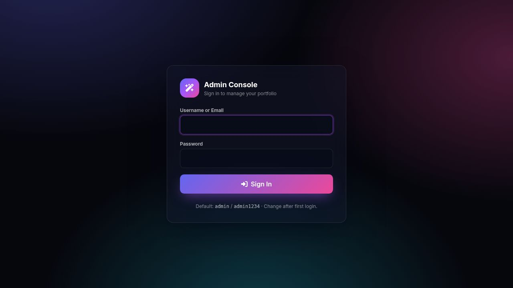

Access the admin at `/admin/login.php`. Enter your username (or email) and password. Sessions are valid for 4 hours. Repeated wrong-password attempts are rate-limited per session.

---

### 7.1 Dashboard — `/admin/dashboard.php`

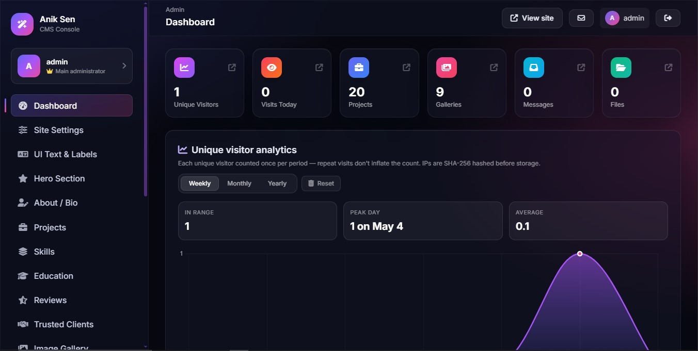

The first screen after login. Provides an at-a-glance status of your portfolio.

**What you see:**
- **KPI Tiles** — total projects published, unread messages today, total unique visitors.
- **Visitor Analytics Chart** — powered by Chart.js with three tabs: **Weekly**, **Monthly**, **Yearly**. Visitor counts are privacy-friendly (salted SHA-256 IP hashes — no raw IP addresses are ever stored).
- **Reset Analytics** button — clears all visitor records, protected by CSRF and session validation.

**API endpoints used:**
- `GET /admin/api/visitors.php?range=weekly|monthly|yearly` → JSON `{ labels: [...], data: [...] }`
- `POST /admin/api/visitors_reset.php` → resets records (requires valid CSRF token + active session)

---

### 7.2 Hero Section — `/admin/hero.php`

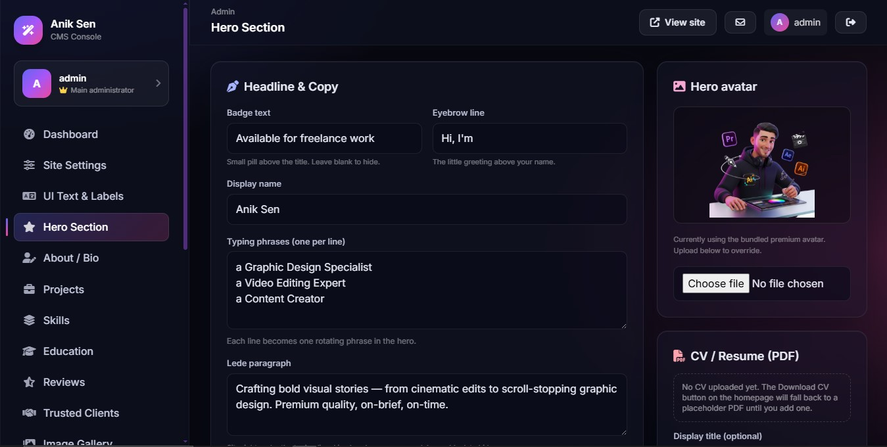

Controls everything in the first section a visitor sees.

**Editable fields:**
- **Name** — displayed as the main `<h1>` heading.
- **Tagline / Intro paragraph** — the short bio text below the name.
- **Animated role titles** — the comma-separated list of titles that cycle through the typewriter effect (e.g. `Graphic Designer, Video Editor, Motion Artist`).
- **CTA button labels** — the text of the "View Work" and "Download CV" buttons.
- **Stats** — years of experience, projects delivered, happy clients.
- **Avatar image** — upload PNG/JPG/WebP. Displayed as the 3D hero image on the right.
- **CV / Resume PDF** — upload the current resume. The upload is rejected unless both the detected MIME type **and** the leading `%PDF-` magic bytes match. Served securely via `cv.php` (no direct file path exposure).

---

### 7.3 About Section — `/admin/about.php`

- Edit the biography text and section heading.
- Upload a **profile photo**.
- Manage the **Core Expertise** bullet list (skills shown in the about card).

---

### 7.4 Skills — `/admin/skills.php`

Two separate sub-sections:

- **Skill bars** — add/edit/delete skills with a name, percentage (0–100), and category. Controls the animated proficiency bars.
- **Software icons** — add/edit/delete software tools shown in the grid (e.g. Photoshop, Premiere Pro, After Effects). Each entry has a name, icon image, and sort order.

---

### 7.5 Projects — `/admin/projects.php`

Full CRUD for portfolio project cards.

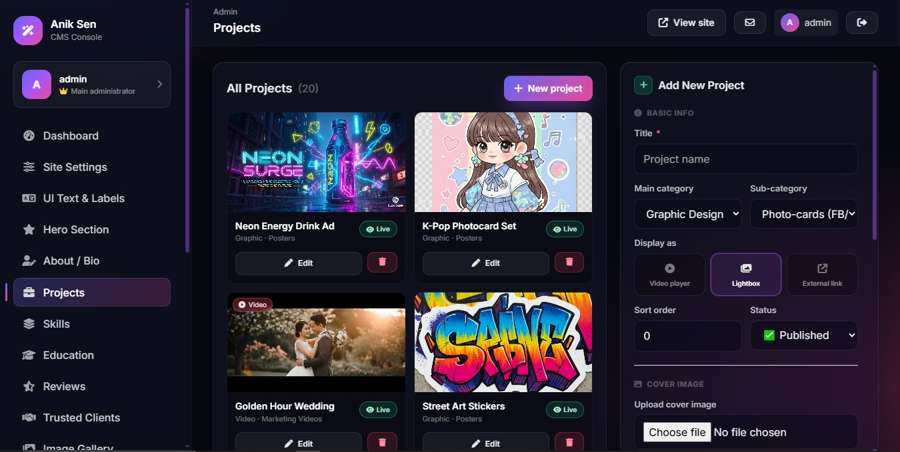

**Per-project fields:**
- Title, category, short description, full description.
- Cover image (uploaded, validated by MIME + magic byte).
- Additional gallery images (multi-image uploader).
- Project link (live URL) and source/case-study link.
- Self-hosted video upload or external video URL (e.g. YouTube/Vimeo).
- Video poster image.
- Sort order and visibility toggle.

Projects appear on the frontend in the **Work** section as filterable cards.

---

### 7.6 Gallery — `/admin/gallery.php`

Manage a lightbox-style image gallery separate from project portfolios.

- Create and rename **Gallery Categories**.
- Upload images into each category with a title and sort order.
- Toggle individual images visible/hidden.

---

### 7.7 Trusted Clients — `/admin/brandlist.php`

Manages the client logo strip shown on the portfolio.

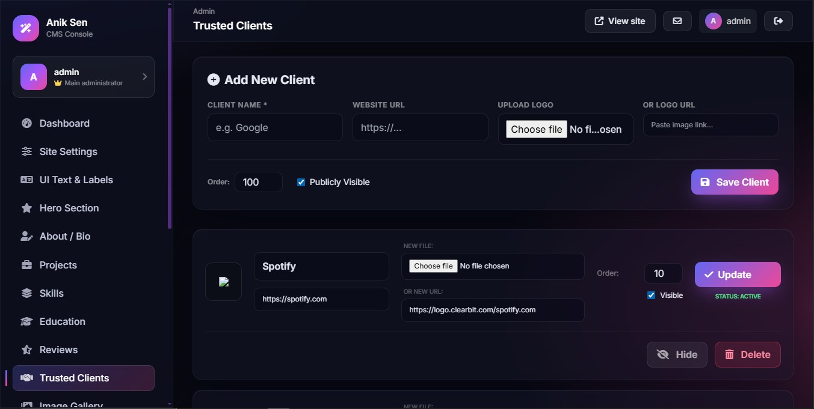

**Per-client fields:**
- **Name** — company or client name.
- **Website URL** — optional link to their site (opened when the logo is clicked).
- **Logo** — upload an image file **or** paste an external image address.
- **Sort order** and **visibility toggle**.

> **Technical note:** External logo addresses are stored in the database and decoded client-side via `atob()` to prevent AwardSpace's WAF from flagging `https://` in HTML attribute values.

---

### 7.8 Reviews — `/admin/reviews.php`

Manage client testimonials displayed in the Reviews section.

**Per-review fields:**
- Reviewer name, job title, company.
- Profile photo upload.
- Star rating (1–5).
- Testimonial text.
- Sort order and visibility toggle.

---

### 7.9 Education — `/admin/education.php`

Add academic degrees, diplomas, professional certifications, or courses.

**Per-entry fields:**
- Degree / qualification title.
- Institution name.
- Start year, end year (or "Present").
- Description / notes.
- Sort order.

---

### 7.10 Messages (Inbox) — `/admin/messages.php`

All contact form submissions are stored here.

**Features:**
- Paginated list of messages (newest first).
- **Read / Unread** state (unread badge in the sidebar).
- Full-text search by sender name or email.
- View full message body in-page.
- Hard-delete individual messages.

> **Note:** If your host disables `mail()`, messages are still safely stored here — the contact form never silently fails.

---

### 7.11 Sections & Menus — `/admin/sections.php`

**Section Visibility Toggles:**
Toggle any of the nine portfolio sections (Hero, About, Skills, Work, Gallery, Clients, Reviews, Education, Contact) on or off. `index.php` skips hidden sections entirely — no code changes required.

**Header Navigation:**
Full CRUD for the sticky top navigation links. Each item has a label, target anchor/URL, and sort order. Changes appear instantly on the frontend.

**Footer Navigation:**
Same as header — a separate list of links rendered in `includes/footer.php`.

---

### 7.12 Settings — `/admin/settings.php`

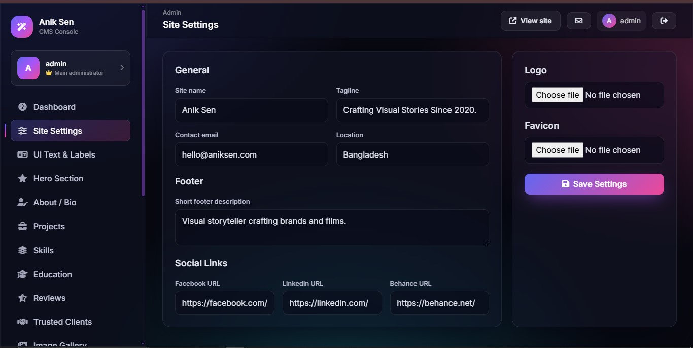

Site-wide configuration that feeds into every page's `<head>` and footer.

| Field | Usage |
|---|---|
| Site title | `<title>` tag + `og:title` |
| Tagline | Sub-heading in hero, used in schema.org markup |
| Meta description | `<meta name="description">` + `og:description` |
| Meta keywords | `<meta name="keywords">` |
| Social links | Header/footer icons + `og:` / Twitter Card meta |
| Footer copyright | Copyright text in `<footer>` |
| Custom `<head>` HTML | For GA4 / Plausible / Search Console verification tags |

---

### 7.13 UI Text — `/admin/uitext.php`

Override any static text string used across the frontend (section headings, button labels, placeholder copy) without editing PHP template files.

---

### 7.14 File Library — `/admin/files.php`

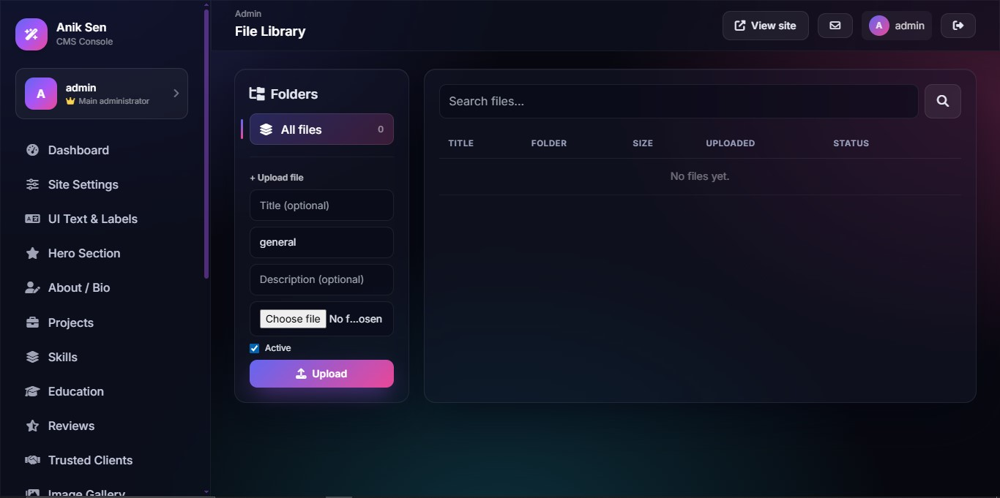

Browse and manage every uploaded file in `uploads/docs/`.

- View file name, size, upload date, folder.
- Flag which PDF is the **active CV** (served by `cv.php`).
- Toggle file visibility and delete entries.

---

### 7.15 Media & Files Hub — `/admin/filehub.php`

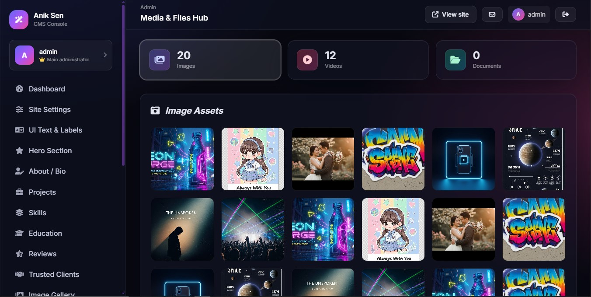

A read-only visual audit of all media assets referenced across the entire database, organised into three tabs:

| Tab | Contents |
|---|---|
| **Images** | All locally uploaded images from projects, hero, about, gallery, clients and admin avatars — shown as a thumbnail grid |
| **Videos** | Self-hosted project videos (inline player) and external video links (labelled badge + open button) |
| **Documents** | Full table of all file library entries with type icon, folder, size and download button |

> External video addresses are shown via a client-side `atob()` decode to keep raw URLs out of the HTML response and avoid WAF blocks on shared hosting.

---

### 7.16 Users — `/admin/users.php`

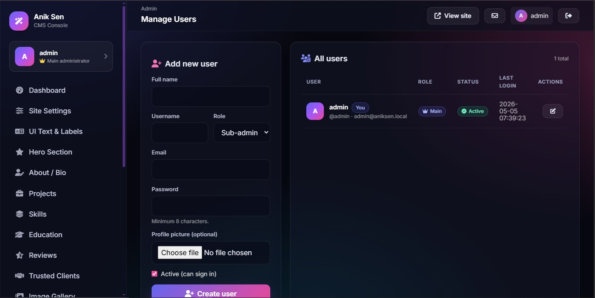

Manage administrator accounts that can log into `/admin/`.

- Add new admin users (username, email, password).
- Edit existing users.
- Delete users (cannot delete the currently signed-in account).

---

### 7.17 Account — `/admin/account.php`

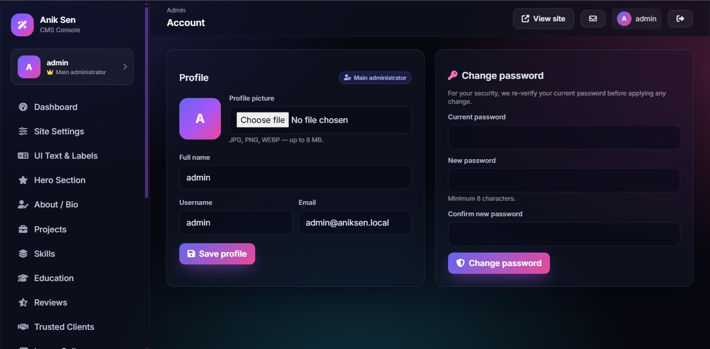

Your personal admin profile settings.

- Change your **display name** and **email**.
- Upload a **profile photo** (shown in the admin sidebar).
- Change your **password** (requires current password confirmation).

---

## 8. GitHub Actions Deployment

The repo includes a CI/CD workflow at `.github/workflows/deploy.yml` that automatically FTP-deploys to AwardSpace (or any FTP host) on every push to `main`.

### Setup

1. Go to **GitHub → Settings → Secrets and Variables → Actions** and add:

   | Secret | Value |
   |---|---|
   | `FTP_SERVER` | Your FTP hostname (e.g. `ftp.anik-sen.atwebpages.com`) |
   | `FTP_USERNAME` | Your FTP username |
   | `FTP_PASSWORD` | Your FTP password |

2. Push to `main` — the workflow deploys all changed files automatically.

### Workflow Configuration (key settings)

```yaml
- uses: SamKirkland/FTP-Deploy-Action@v4.3.5
  with:
    server: ${{ secrets.FTP_SERVER }}
    username: ${{ secrets.FTP_USERNAME }}
    password: ${{ secrets.FTP_PASSWORD }}
    server-dir: /anik-sen.atwebpages.com/    # absolute path, no ./ prefix
    danger-allow-clean: false                 # never wipe the remote directory
    exclude: |
      **/.git*
      **/.git*/**
      **/data/**
      **/.env
      **/.local/**
      **/attached_assets/**
```

> `danger-allow-clean: false` is critical — without it, the action attempts to clean the remote directory first and fails with an FTP 550 error before uploading anything.

---

## 9. Shared Hosting Deployment

### AwardSpace (tested and confirmed working)

1. Create a MySQL database from the AwardSpace control panel and note the credentials.
2. Upload all project files into your domain's root folder via FTP or the File Manager.
3. In the AwardSpace MySQL Manager, set environment variables **or** edit `config/config.php` directly:
   ```php
   'driver'   => 'mysql',
   'host'     => 'mysqlXX.awardspace.net',
   'dbname'   => 'your_db_name',
   'user'     => 'your_db_user',
   'password' => 'your_db_password',
   ```
4. Visit your domain — migrations run automatically and the site is live.
5. Log in at `/admin/` with `admin` / `admin1234` and **change the password immediately**.

**AwardSpace WAF notes:**
- The codebase is specifically hardened against AwardSpace's ModSecurity WAF.
- URL detection in PHP uses `preg_match('/^\w[\w.\-]+$/', $val)` instead of `str_contains($var, "://")` — the latter triggers the RFI detection rule.
- External URLs in HTML output (logo images, video links, website links) are stored in `data-xref` attributes as `base64_encode()` output and decoded client-side with `atob()`, keeping raw `https://` strings out of the HTTP response body.

### InfinityFree / 000webhost / ProFreeHost

Follow the same flow as AwardSpace. Most free PHP hosts:
- Disable `mail()` — contact form messages are still saved in the admin inbox.
- Provide 2 MB file upload limit — increase via a `php.ini` file upload if needed.
- Provide free SSL automatically — force HTTPS via the control panel.

---

## 10. VPS / Cloud Deployment

### Nginx + PHP-FPM (Ubuntu 22.04+)

```bash
sudo apt update
sudo apt install -y nginx php8.2-fpm php8.2-cli php8.2-mysql php8.2-sqlite3 \
                    php8.2-mbstring php8.2-xml mariadb-server certbot python3-certbot-nginx git

# Clone the project
sudo mkdir -p /var/www/aniksen
git clone <your-repo-url> /var/www/aniksen
sudo chown -R www-data:www-data /var/www/aniksen/data /var/www/aniksen/uploads
sudo chmod -R 755 /var/www/aniksen/uploads
```

**Nginx server block** `/etc/nginx/sites-available/aniksen`:

```nginx
server {
    listen 80;
    server_name aniksen.com www.aniksen.com;
    root /var/www/aniksen;
    index index.php;

    location / {
        try_files $uri $uri/ /index.php?$query_string;
    }

    location ~ \.php$ {
        include snippets/fastcgi-php.conf;
        fastcgi_pass unix:/run/php/php8.2-fpm.sock;
        fastcgi_param DB_DRIVER    "mysql";
        fastcgi_param DB_HOST      "localhost";
        fastcgi_param DB_NAME      "anik_portfolio";
        fastcgi_param DB_USER      "anik";
        fastcgi_param DB_PASSWORD  "STRONG_PASSWORD";
        fastcgi_param APP_BASE_URL "https://aniksen.com";
    }

    location ~* /(classes|config|data|sql)/ { deny all; return 404; }

    location ~* \.(css|js|png|jpe?g|webp|svg|woff2?)$ {
        expires 30d;
        add_header Cache-Control "public, immutable";
    }
}
```

```bash
sudo ln -s /etc/nginx/sites-available/aniksen /etc/nginx/sites-enabled/
sudo nginx -t && sudo systemctl reload nginx
sudo certbot --nginx -d aniksen.com -d www.aniksen.com
```

### Docker

```dockerfile
FROM php:8.2-apache
RUN docker-php-ext-install pdo_mysql pdo_sqlite && a2enmod rewrite
COPY . /var/www/html/
RUN chown -R www-data:www-data /var/www/html/data /var/www/html/uploads
EXPOSE 80
```

```bash
docker build -t aniksen-portfolio .
docker run -d -p 80:80 \
  -e DB_DRIVER=mysql -e DB_HOST=db -e DB_NAME=anik \
  -e DB_USER=anik -e DB_PASSWORD=secret \
  -v aniksen_uploads:/var/www/html/uploads \
  -v aniksen_data:/var/www/html/data \
  aniksen-portfolio
```

---

## 11. SEO & Core Web Vitals

### Meta Tags (auto-generated)

`includes/header.php` emits on every request:

- `<title>` — from *Settings → Site title*
- `<meta name="description">` — from *Settings → Meta description*
- `<meta name="keywords">` — from *Settings → Meta keywords*
- Canonical URL
- **Open Graph** — `og:title`, `og:description`, `og:image`, `og:url`
- **Twitter Card** — `summary_large_image`
- **Schema.org JSON-LD** — `Person` + `WebSite` markup

### robots.txt & Sitemap

`robots.txt` blocks `/admin/` and points to `/sitemap.xml`. Update `sitemap.xml` when you add new projects or gallery items, or generate it from the `projects` table.

### Search Console Setup

1. Verify ownership at [Google Search Console](https://search.google.com/search-console) using the HTML meta tag method — paste the tag into *Settings → Custom head HTML*.
2. Submit `https://yourdomain.com/sitemap.xml`.
3. Request indexing of the home page.
4. Repeat at [Bing Webmaster Tools](https://www.bing.com/webmasters).

### Performance Tips

- Convert all new image uploads to WebP: `cwebp -q 80 input.png -o output.webp`
- Enable **Brotli** + **HTTP/2** on your host or Cloudflare proxy.
- For Cloudflare: enable *Auto Minify* (HTML/CSS/JS) and orange-cloud proxy mode.
- Target TTI < 3 s on a Moto G4 throttle test.

---

## 12. Security Checklist

Complete these steps before going live:

- [ ] Change the default admin password at `/admin/account.php`.
- [ ] Set `ADMIN_PASS` as an environment variable so the seeded credential is rotated.
- [ ] Set `APP_DEBUG=false` (or leave it unset — default is `false`).
- [ ] Force HTTPS at the host or reverse-proxy level.
- [ ] Confirm direct HTTP access to `/classes/`, `/config/`, `/data/`, `/sql/` returns 403/404 (the included `.htaccess` handles this for Apache).
- [ ] Set `uploads/` and `data/` to `chmod 755` (writable by web server, not world-executable).
- [ ] Back up `data/portfolio.sqlite` (or your MySQL dump) on a schedule.
- [ ] Keep PHP patched: `apt upgrade php8.2-*` (VPS) or use your host's auto-update.
- [ ] Rotate the `APP_KEY` / session secret if you customise `config.php`.

---

## 13. Troubleshooting

| Symptom | Solution |
|---|---|
| **Blank page after deploy** | Set `APP_DEBUG=true` temporarily and reload to see the PHP error message. |
| **`PDOException: could not find driver`** | Install `php-sqlite3` (SQLite) or `php-mysql` (MySQL) and reload PHP-FPM. |
| **`SQLSTATE[HY000][14] unable to open database`** | Run `chown www-data:www-data data/ && chmod 775 data/`. |
| **Image / CV upload fails** | Ensure `uploads/images/` and `uploads/docs/` are writable (`chmod 755`). |
| **"Invalid PDF" on CV upload** | The file must start with `%PDF-` bytes — this is a deliberate security check. |
| **Dashboard shows "Reset Failed"** | Session expired. Log out and back in, then retry. |
| **Admin returns 403 on AwardSpace** | The file likely contains a WAF-triggering pattern. Refer to `UPLOAD_TO_AWARDSPACE.txt` for the full diagnosis and fixed file list. |
| **Images not showing after deploy** | Files are in `uploads/` which is excluded from FTP deploy. Upload `uploads/` contents manually via FTP or AwardSpace File Manager. |
| **Tailwind CDN warning in browser console** | Expected — the warning fires only for the admin-only Tailwind CDN script. It has no effect on site visitors. |
| **Mixed content warning after HTTPS** | Set `APP_BASE_URL=https://yourdomain.com` in your environment. |
| **Menu or section changes not visible** | Hard-reload the browser (`Ctrl+Shift+R`) — Nginx may be serving a cached response. |
| **MySQL migration fails on shared hosting** | Ensure your DB user has `CREATE` + `ALTER` + `INDEX` privileges. Increase `max_allowed_packet` if needed. |
| **FTP deploy fails with "550" error** | Ensure `danger-allow-clean: false` is set in `deploy.yml` and `server-dir` uses an absolute path without `./` prefix. |

---

## 14. Credits

| Role | Name |
|---|---|
| Site owner | **Anik Sen** — Graphic Designer & Video Editor |
| Design, engineering & maintenance | **Aryaan Dhar Badhon** |
| 3D hero artwork | Commissioned for this project |

If you fork or adapt this CMS, please retain the **"Built by Aryaan Dhar Badhon"** credit in the footer.

---

*© Aryaan Dhar Badhon. All rights reserved.*
